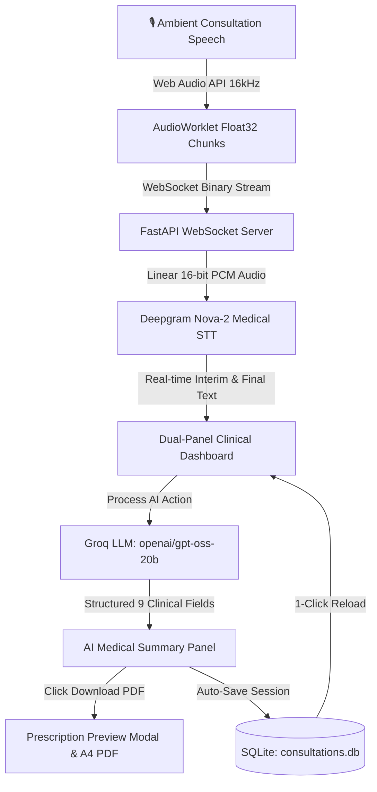

# 🩺Doctors Clinic — Live Ambient AI Medical Scribe & Clinical EHR

An ambient AI medical scribe that listens to natural doctor-patient consultations via the browser microphone, transcribes speech in real time using **Deepgram Nova-2 Medical STT**, extracts 9 standardized clinical EHR field groups with **Groq Cloud LLMs (`openai/gpt-oss-20b`)**, and generates 1-click **A4 Prescription PDFs** with SQLite session persistence.

---

## 🎯 Problem Statement (PS)

- **The 2:1 Administrative Burden**: Physicians spend 2 hours entering EHR notes for every 1 hour of patient care, causing documentation fatigue and "pajama time".
- **Broken Doctor-Patient Rapport**: Continuous typing into computers during visits disrupts eye contact and weakens patient trust.
- **The Ambient AI Solution**: An invisible AI assistant listening in real time, structuring clinical dialogue into standardized EHR fields (strictly separating positive symptoms from stated negatives) in $<1.5$s, and producing instant hospital-grade prescriptions.

---

<a href="https://youtube.com" target="_blank">
   
</a>


## 🔄 System Architecture & Workflow

### Universal Visual Flowchart

```
┌────────────────────────────────────────────────────────────────────────┐
│                  1. AMBIENT DOCTOR-PATIENT SPEECH                      │
│      Natural in-room clinical dialogue captured via Browser Mic        │
└──────────────────────────────────┬─────────────────────────────────────┘
                                   │ 16 kHz Mono (Float32 PCM)
                                   ▼
┌────────────────────────────────────────────────────────────────────────┐
│             2. CLIENT-SIDE WEBAUDIO & AUDIOWORKLET                     │
│    AudioWorklet thread captures chunks & streams over WebSocket        │
└──────────────────────────────────┬─────────────────────────────────────┘
                                   │ /ws/transcribe (Binary PCM)
                                   ▼
┌────────────────────────────────────────────────────────────────────────┐
│             3. FASTAPI BACKEND & AUDIO PREPROCESSING                   │
│      NumPy converts Float32 to Int16 PCM (16,000 Hz, signed LE)        │
└──────────────────────────────────┬─────────────────────────────────────┘
                                   │ wss://api.deepgram.com/v1/listen
                                   ▼
┌────────────────────────────────────────────────────────────────────────┐
│             4. DEEPGRAM NOVA-2 MEDICAL CLOUD STREAMING                 │
│      Sub-300ms real-time interim & final medical speech recognition    │
└──────────────────┬──────────────────────────────────┬──────────────────┘
                   │ Interim JSON                     │ Final JSON
                   ▼                                  ▼
      ┌─────────────────────────┐        ┌─────────────────────────┐
      │  TOP LIVE CHUNK BOX     │        │ BOTTOM CUMULATIVE BOX   │
      │  Waveform + Live Speech │        │ Complete Consultation   │
      └─────────────────────────┘        └────────────┬────────────┘
                                                      │
                       "⚡ Process Transcript with AI"│
                                                      ▼
┌────────────────────────────────────────────────────────────────────────┐
│             5. GROQ CLOUD INFERENCE (openai/gpt-oss-20b)               │
│     Single-pass extraction into 9 clinical field groups (<1.5s)        │
│     Strictly isolates Reported Positives (+) from Stated Negatives (-) │
└──────────────────┬──────────────────────────────────┬──────────────────┘
                   │                                  │
                   ▼                                  ▼
┌──────────────────────────────────────┐ ┌───────────────────────────────┐
│ 6. RELATIONAL PERSISTENCE (SQLite)   │ │ 7. FORMATTED PRESCRIPTION PDF │
│ consultations.db (1-click reload)    │ │ A4 download & vector print    │
└──────────────────────────────────────┘ └───────────────────────────────┘
```

### Mermaid Architecture



> 📖 **Deep Dive**: See [docs/ARCHITECTURE.md](docs/ARCHITECTURE.md) for the detailed 7-step data flow lifecycle and WebSocket protocols.

---

## 🛠️ Technology Stack

| Layer | Technology | Version / Model | Purpose |
| :--- | :--- | :--- | :--- |
| **Frontend UI** | HTML5, CSS3, Vanilla JS | ES6+ Native Web Standards | Dual-panel layout matching assignment specification; zero build step. |
| **Audio Capture** | Web Audio API (`AudioWorklet`) | 16 kHz Mono | High-fidelity raw PCM audio capture in background audio thread. |
| **Speech-to-Text** | Deepgram Cloud Streaming SDK | `nova-2-medical` | Sub-300ms medical speech transcription over WebSocket. |
| **Clinical LLM** | Groq Cloud API | `openai/gpt-oss-20b` *(auto-fallback)* | Single-pass structured extraction of 9 clinical EHR field groups. |
| **Backend** | FastAPI + Uvicorn | `>= 0.109.0` | Asynchronous REST endpoints and full-duplex WebSocket streaming. |
| **PDF Engine** | `html2pdf.js` + Native `@media print` | v0.10.1 / Browser Native | A4 hospital prescription PDF download + 300 DPI vector printing. |
| **Database** | SQLite 3 | Embedded (`consultations.db`) | Relational persistence for full transcripts, audio metrics, and EHR records. |

---

## 🚀 Quickstart Setup & Run

### 1. Create & Activate Virtual Environment

**Windows (PowerShell)**:
```powershell
python -m venv venv
.\venv\Scripts\Activate.ps1
```
*(If execution policy restricts scripts: `Set-ExecutionPolicy -Scope Process -ExecutionPolicy Bypass`)*

**macOS / Linux**:
```bash
python3 -m venv venv && source venv/bin/activate
```

### 2. Install Dependencies
```bash
pip install -r requirements.txt
```

### 3. Setup API Keys & Environment (`.env`)
1. **Deepgram API Key** (STT): Sign up at [console.deepgram.com](https://console.deepgram.com/signup) ($200 free credit) $\rightarrow$ API Keys $\rightarrow$ Create Key.
2. **Groq API Key** (Clinical LLM): Sign up at [console.groq.com](https://console.groq.com) $\rightarrow$ API Keys $\rightarrow$ Create Key.

Create a `.env` file in the project root:
```env
DEEPGRAM_API_KEY=your_deepgram_api_key_here
DEEPGRAM_MODEL=nova-2-medical
GROQ_API_KEY=your_groq_api_key_here
GROQ_MODEL=openai/gpt-oss-20b
HOST=127.0.0.1
PORT=8000
```

### 4. Start the Application
```powershell
python start.py
```
Open **`http://127.0.0.1:8000`** in your browser:
1. Click **Start Mic** and speak clinical dialogue.
2. Click **⚡ Process Transcript with AI** (or **Stop**) to extract the 9 structured EHR fields.
3. Click **📄 Download Prescription (PDF)** to preview and export the formatted prescription.
4. Click **🕒 History** to reload past consultations from SQLite.

---

## 📚 Detailed Documentation

For exhaustive specifications and implementation deep-dives, consult the `docs/` folder:
- [🏗️ System Architecture & Data Flow](docs/ARCHITECTURE.md): Sequential 7-step data lifecycle, WebSocket binary protocol, and audio chunking.
- [🩺 Clinical EHR & Symptom Isolation](docs/CLINICAL_EHR.md): Breakdown of the 9 EHR fields, positive vs. negative symptom separation rules, and LLM JSON schema.
- [💾 Database Schema & Persistence](docs/DATABASE.md): SQLite table definitions, column types, and consultation reload APIs.
- [📄 Prescription Modal & PDF Engine](docs/PDF_PRESCRIPTION.md): Modal design, on-screen visible rendering fix, and native `@media print` vector export.
